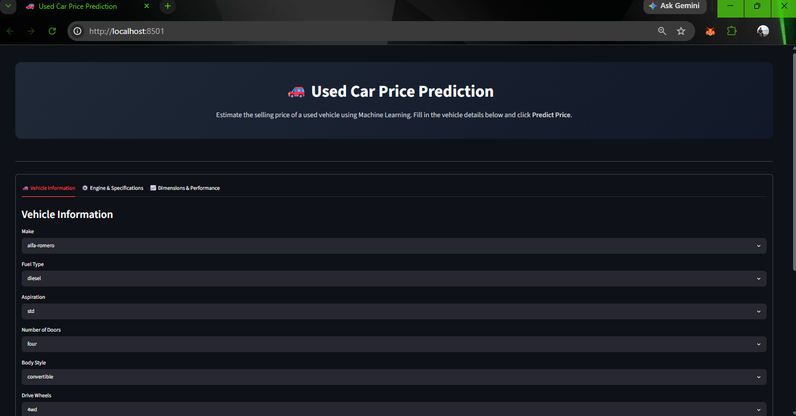
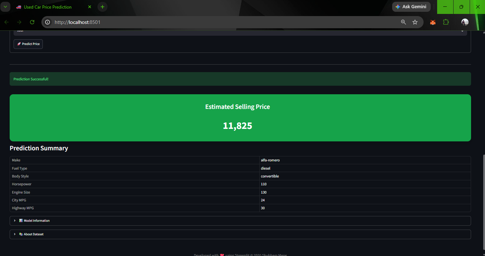

# 🚗 Used Car Price Prediction using Machine Learning

## 📌 Project Overview

This project is an end-to-end Machine Learning application that predicts the selling price of a used car based on its specifications. The project demonstrates the complete machine learning workflow, including data cleaning, exploratory data analysis (EDA), feature engineering, model building, hyperparameter tuning, model evaluation, and deployment using Streamlit.

The application allows users to enter vehicle details through a user-friendly web interface and receive an estimated selling price generated by a trained Random Forest Regression model.

---

## 🎯 Objectives

* Predict the selling price of used cars using machine learning.
* Perform comprehensive exploratory data analysis to identify important trends.
* Apply data preprocessing and feature engineering techniques.
* Compare multiple regression algorithms.
* Optimize the best-performing model using hyperparameter tuning.
* Deploy the trained model as an interactive Streamlit application.

---

# 📂 Project Structure

```
Used_Car_Price_Prediction/

│
├── app.py
├── README.md
├── requirements.txt
├── setup.py
├── .gitignore
│
├── assets/
│   ├── style.css
│   └── car_banner.jpg
│
├── data/
│   ├── raw/
│   └── processed/
│
├── models/
│   ├── best_model.pkl
│   ├── features.pkl
│   ├── make_encoder.pkl
│   ├── dropdown_values.pkl
│
├── notebooks/
│   ├── 01_Data_Checks.ipynb
│   ├── 02_EDA.ipynb
│   ├── 03_Data_Preprocessing.ipynb
│   ├── 04_Model_Building.ipynb
│   └── 05_Prediction.ipynb
│
└── src/
    ├── preprocess.py
    ├── predict.py
    └── utils.py
```

---

# 📊 Dataset

The dataset contains information about different automobiles and their selling prices.

### Features include

* Make
* Fuel Type
* Aspiration
* Number of Doors
* Body Style
* Drive Wheels
* Engine Location
* Engine Type
* Number of Cylinders
* Fuel System
* Wheel Base
* Length
* Width
* Height
* Curb Weight
* Engine Size
* Bore
* Stroke
* Compression Ratio
* Horsepower
* Peak RPM
* City MPG
* Highway MPG

**Target Variable**

* Price

---

# 🔍 Exploratory Data Analysis

The following analyses were performed:

### Data Quality Checks

* Missing value analysis
* Duplicate detection
* Data type verification
* Statistical summary
* Unique value analysis

### Univariate Analysis

* Histograms
* Box Plots
* KDE Plots
* Count Plots

### Bivariate Analysis

* Price vs Horsepower
* Price vs Engine Size
* Price vs Curb Weight
* Price vs Width
* Price vs Fuel Type
* Price vs Body Style

### Multivariate Analysis

* Correlation Heatmap
* Feature Correlation Analysis

---

# ⚙️ Data Preprocessing

The preprocessing pipeline includes:

* Data cleaning
* Missing value treatment
* Duplicate removal
* Outlier treatment (Linear Regression dataset)
* Target Encoding for high-cardinality features
* One-Hot Encoding
* Feature Scaling (Linear Models)
* Train-Test Split
* Saving preprocessing artifacts using Joblib

Saved artifacts include:

* `best_model.pkl`
* `features.pkl`
* `make_encoder.pkl`
* `dropdown_values.pkl`

---

# 🤖 Machine Learning Models

The following regression models were trained and evaluated:

* Linear Regression
* Ridge Regression
* Lasso Regression
* ElasticNet
* K-Nearest Neighbors Regressor
* Decision Tree Regressor
* Random Forest Regressor
* Extra Trees Regressor
* Gradient Boosting Regressor
* AdaBoost Regressor
* XGBoost Regressor
* Support Vector Regressor

---

# 🏆 Best Model

**Random Forest Regressor**

The Random Forest model achieved the best overall performance and was selected for deployment.

Evaluation Metrics

* Train R²: *(Update with your value)*
* Test R²: *(Update with your value)*
* MAE: *(Update with your value)*
* RMSE: *(Update with your value)*

---

# 📈 Model Evaluation

Performance was evaluated using:

* R² Score
* Mean Absolute Error (MAE)
* Root Mean Squared Error (RMSE)

Visualization includes:

* Actual vs Predicted Plot
* Residual Plot
* Feature Importance Plot
* Model Comparison

---

# 🌐 Streamlit Application

The deployed web application allows users to:

* Select vehicle information
* Enter engine specifications
* Provide mileage and dimensions
* Predict the estimated selling price instantly
* View a summary of the entered vehicle specifications

---

# 🛠 Technologies Used

### Programming

* Python

### Data Analysis

* Pandas
* NumPy

### Visualization

* Matplotlib
* Seaborn

### Machine Learning

* Scikit-learn
* XGBoost

### Deployment

* Streamlit

### Model Serialization

* Joblib

### Development Environment

* Jupyter Notebook
* VS Code

---

# 🚀 Installation

Clone the repository

```bash
git clone https://github.com/ShubhamMane1211/Used_Car_Price_Prediction.git
```

Navigate to the project directory

```bash
cd Used_Car_Price_Prediction
```

Install the required dependencies

```bash
pip install -r requirements.txt
```

Run the Streamlit application

```bash
streamlit run app.py
```

---

# 📷 Application Preview


## Home Page



## Prediction Result


---

# 🔮 Future Improvements

* Deploy on Streamlit Community Cloud
* Add LightGBM and CatBoost models
* Implement SHAP for model explainability
* Improve feature engineering
* Integrate database support for prediction history

---

# 👨‍💻 Author

**Shubham Mane**

* GitHub: https://github.com/ShubhamMane1211
* LinkedIn: https://linkedin.com/in/shubhammane1211

---

## ⭐ If you found this project useful, consider giving it a star on GitHub!
